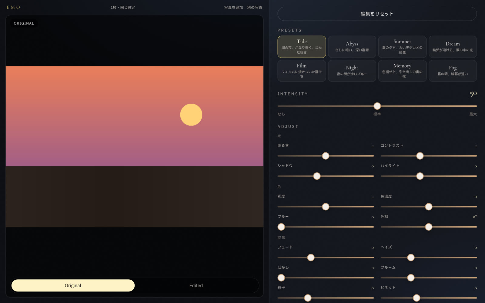
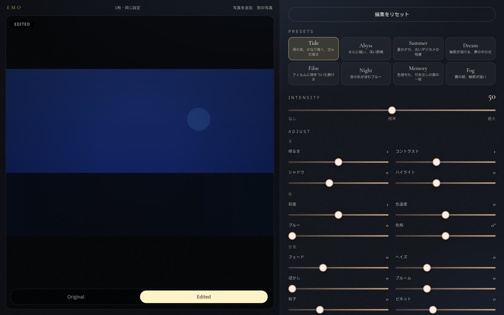
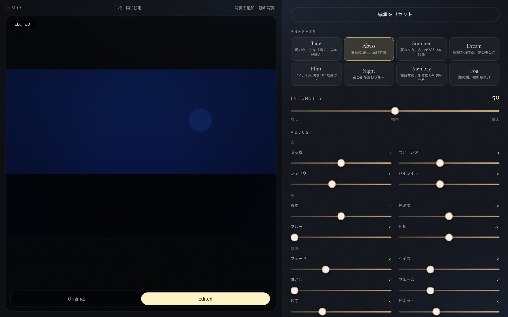
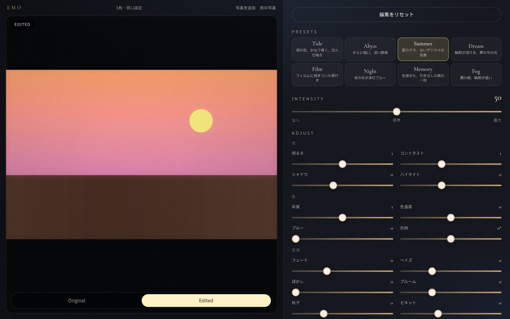
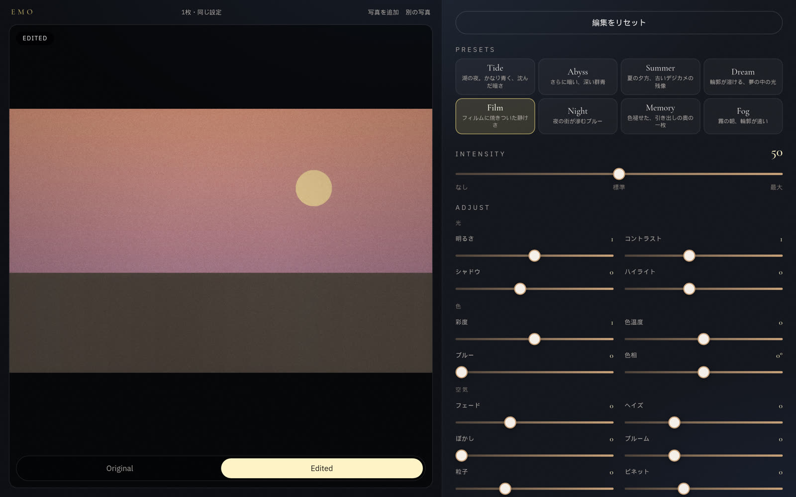
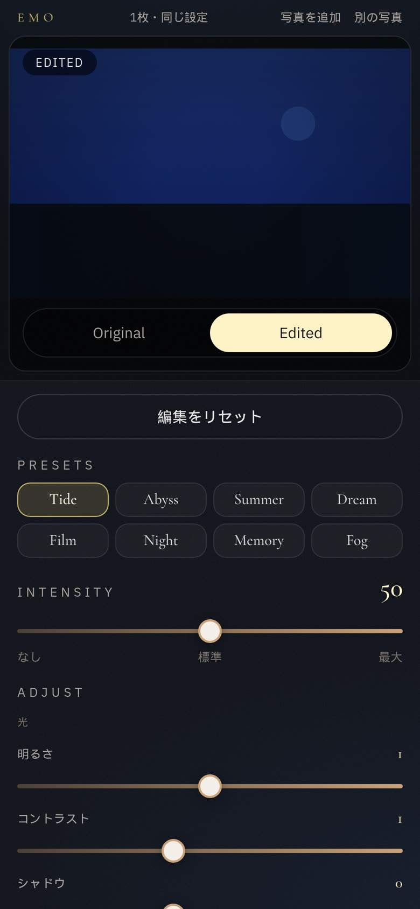
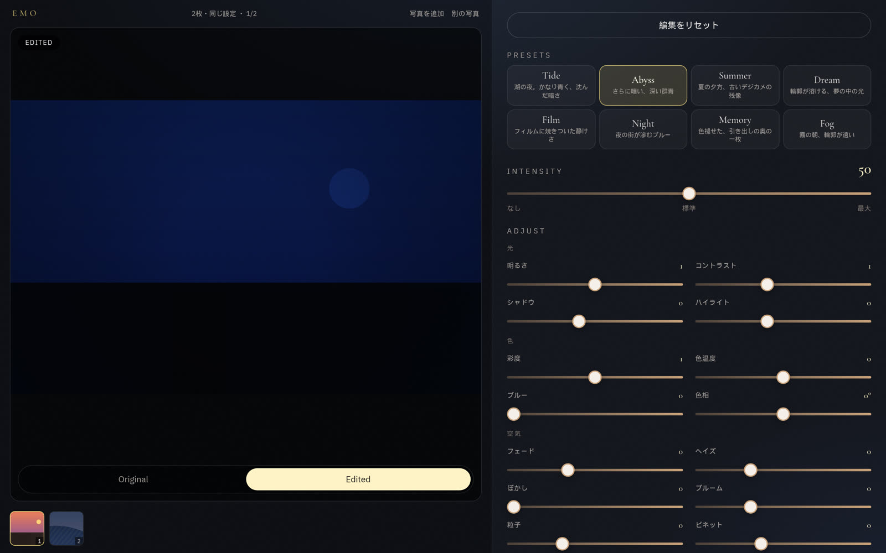

# Emo Image Editor

普通の写真を、記憶の中の写真のような雰囲気に変えるブラウザ完結型の画像加工アプリです。

サーバーへは送りません。アップロード・プリセット・比較・保存はすべて端末の中で完結します。

<p align="center">
  
</p>

<p align="center"><em>Drop your memory — 写真を置くだけ。</em></p>

## こんな雰囲気にできる

同じ夕焼けでも、プリセットで空気が変わります。

| Original | Tide | Abyss |
| --- | --- | --- |
|  |  |  |

**Tide / Abyss** は、青くて暗い夜のトーン。**Summer** は夕方の残像、**Film** は少し色褪せたフィルム感です。

<p align="center">
  
</p>

<p align="center">
  
</p>

## 画面の使い方

PC では画面いっぱいに左右分割。左がプレビュー、右が操作です。下まで長くスクロールしなくても編集できます。

スマホでは写真を上部に固定したまま、下のスライダーを動かせます。

<p align="center">
  
</p>

Original / Edited の切り替えは、いつも画像のすぐ下にあります。

## できること

- JPEG / PNG / WebP を 1 枚でも複数枚でもアップロード（選択 / ドロップ）
- 8 プリセット: Tide / Abyss / Summer / Dream / Film / Night / Memory / Fog
- 加工強度 0–100（初期値 50）
- 詳細調整: 明るさ・コントラスト・シャドウ・ハイライト・彩度・色温度・ブルー・色相・フェード・ヘイズ・ぼかし・ブルーム・粒子・ビネット
- **編集をリセット** でプリセット・強度・スライダーを初期値へ
- 複数枚を同じ設定でまとめて加工。サムネイルで切り替え、一括保存は ZIP
- JPEG / PNG ダウンロード
- 大きな画像はプレビュー用に最大 1920px へ縮小

<p align="center">
  
</p>

<p align="center"><em>2 枚・同じ設定。JPEG 2枚 で ZIP にまとめて保存。</em></p>

上限は 30 枚です。編集中に「写真を追加」もできます。

## 開発

```bash
npm install
npm run dev
```

本番ビルド:

```bash
npm run build
npm run preview
```

ブラウザで http://localhost:5173/ を開いてください。

## 技術

React / TypeScript / Vite / Tailwind CSS / HTML Canvas API
